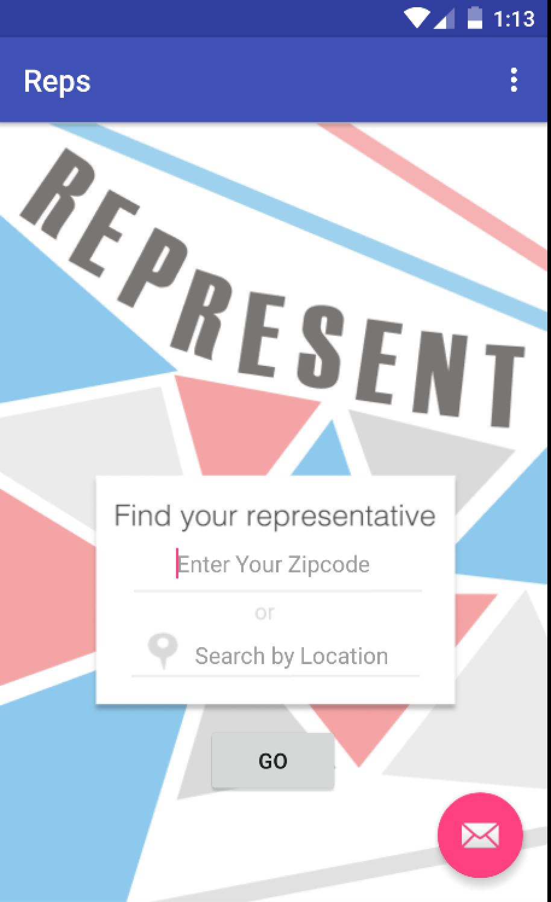
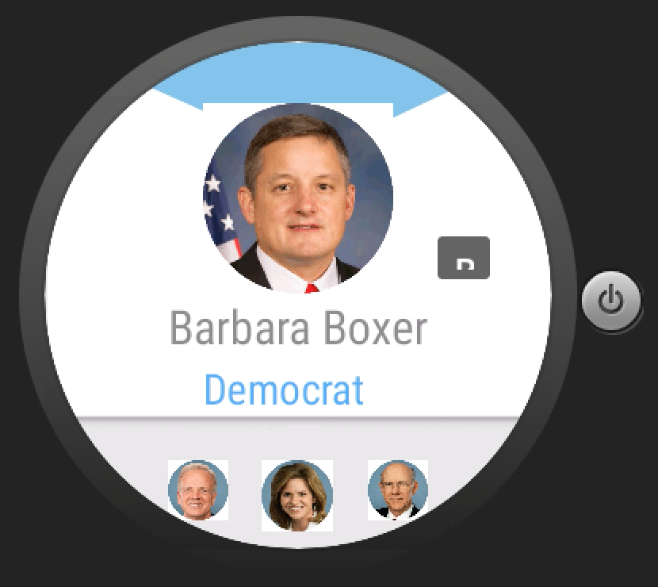
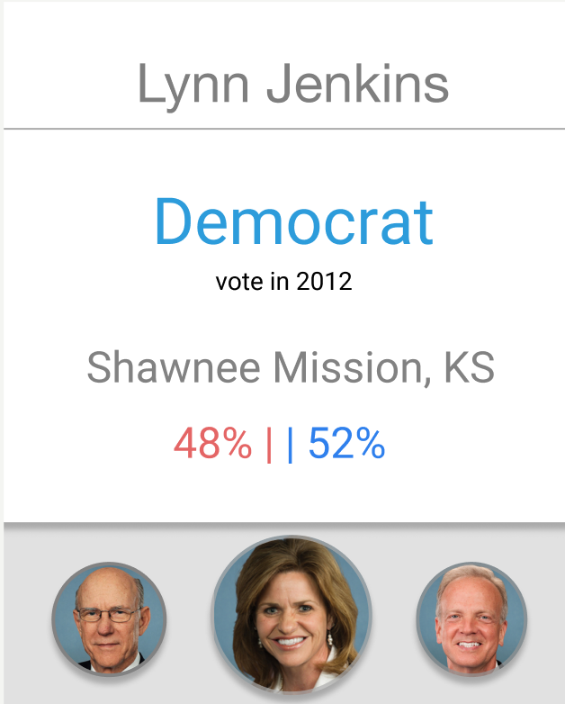

# PROG 02: Represent!

Prog02 - part B 

## Authors

JEssica Zhuge ([jessicazhuge@berkeley.edu](mailto:your_email@berkeley.edu))

## Demo Video

See Project 2B video (https://vimeo.com/157980539)

2C video: (https://vimeo.com/159313327) 

## Screenshots

## Acknowledgments

* Used staff code, thank you! 
* Used code from Ben Jakuben on http://stackoverflow.com/questions/2317428/android-i-want-to-shake-it. to create ShakeListener 
